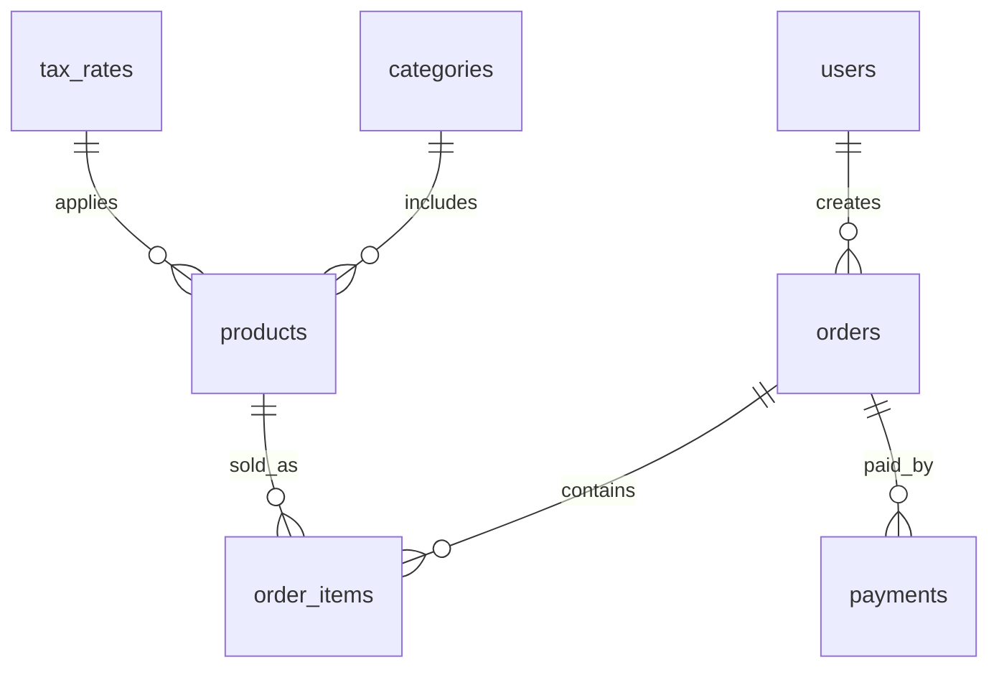

# DB スキーマ / ERD（orders.user_id 追加版）

`orders` に **user_id (FK -> users.id)** を追加し、誰が会計処理を行ったかを監査できるようにしました。

## エンティティ
- **users**: 店員/管理ユーザ（email/role）
- **categories**: 商品カテゴリ
- **tax_rates**: 税区分（標準10%/軽減8% など）
- **products**: 商品マスタ（SKU/バーコード/在庫）
- **orders**: 伝票（user_id で担当者紐付け）
- **order_items**: 伝票明細
- **payments**: 支払

## ERD (Mermaid)

> 注: `orders.user_id` は必須（NOT NULL）運用を推奨（無人会計を除く）。

## カラム概要（差分含む）
| テーブル | カラム | 型 | 備考 |
|---|---|---|---|
| users | id | BIGINT PK | |
| users | email | VARCHAR(255) UNIQUE | |
| users | password_hash | VARCHAR(255) | bcrypt |
| users | role | VARCHAR(20) | clerk/admin |
| orders | user_id | FK -> users.id | **新規** |
| orders | order_no | VARCHAR(40) UNIQUE | 例: YYYYMMDD-#### |
| orders | subtotal | DECIMAL(10,2) | |
| orders | tax_total | DECIMAL(10,2) | |
| orders | total | DECIMAL(10,2) | |
| orders | paid_amount | DECIMAL(10,2) | |
| orders | change_amount | DECIMAL(10,2) | |
| orders | status | VARCHAR(20) | paid/refund 等 |
| orders | created_at | DATETIME | |
| （他テーブルは従来どおり） |  |  |  |

## マイグレーション指針（例）
- 既存 `orders` に `user_id BIGINT NULL` を追加 → 既存行は一時ユーザ（例: `system@local`）のIDで埋める
- `ALTER TABLE orders MODIFY user_id BIGINT NOT NULL` と外部キー付与
- アプリ側は `/auth/login` の `sub` を参照して `POST /orders` で `user_id` を保存
